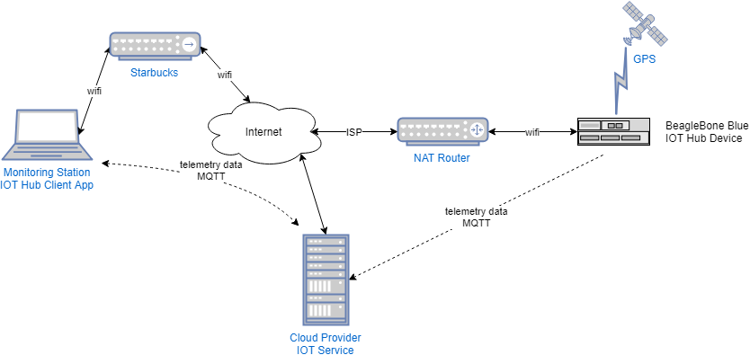

# STEP 1 - Set Up And Test AWS IoT Device
-------------------------------------------

## Create an account on Amazon AWS
  
If you don't already have one, go to [Amazon AWS](https://aws.amazon.com) and create a free account.
You will get a $200.00 credit for 30 days, and a bunch of its services free for one year, plus another bunch
that are always free. Check out the list here : [Amazon AWS Free Tier](https://aws.amazon.com/free).
Most important for this project, the IoT feature (what this project uses) is always free for 250,000 messages (sent and received) per month.

## Prerequisites
  
Before we deploy to the target IoT device, you can do the setup and test using your workstation (Linux, Mac or Windows). The setup requires one of several programming languages to be available. I am going to use JavaScript and NodeJS version 10. So its best to go ahead and have that installed. Any node from version 6 to 12.

## Go to the 'Portal'
  
Once you have an account, sign in to the AWS Management Console. In the search box type 'internet of things'. Select 'IoT Core. It will probably start
on the 'Monitor' screen. At the bottom of the list on the left is 'Learn'. Click that. This gives you some choices. 
You might want to do the tutorial first but you don't need that for this process. 

## Proceed with the Setup

This process is sort of easy to follow but it isn't quite as step-by-step as the Azure Quickstart. 

Here's the process. It will guide you step by step but here are some hints to help out.
  - click 'View connection options' in the 'Connect to AWS IoT' box.
  - click 'Get started' in the 'Configuring a device' box.
  - It shows you the three steps in the setup process. Click 'Get Started'
  - **From here you can just follow their instructions and skip the rest of this list. Or work along with the following items if you want more detail**
  - It asks you to choose a platform. Although the actual Nodejs code is platform independent, their startup code has a shell script that is dependent on either Linux or Windows, so you have to pick.
    - I chose the Node.js SDK.
    - It says you need to be able to connect to the internet (duh)
    - Once you have selected platform and SDK, clock 'Next'
  - It will ask you to give your device a name. I prefer some sort of naming convention, so I named it 'aws-iot-device-bbb' (bbb for beaglebone blue). The only rule here is that device names need to be unique in your account.
  - It offers to let you do optional configuration but you can skip this for now.
  - click 'Next step'.
  - You see 'Download a connection kit' and it shows a summary of what you are getting. If you are happy with that, click the download button. It will download a zip file. Don't do anything with that yet.
  - click 'Next Step'
  - You will see a list of 3 steps to get an example running. Pick a place to unzip the SDK then follow the three steps. They are different on Windows or Linux. 
    - You need to use Powershell on Windows, bash or compatible on Linux.
  - I recommend that after you unzip the SDK file into an empty directory, but before you run the shell script, go into the directory you unzipped it in and run 'npm init' and select defaults. This creates a package.json file that will be updated by the shell script. Otherwise the script doesn't create one. You can skip this and it all works, but this gives you an updated package.json that shows the dependencies you need going forward. 
  - Go ahead and follow the instructions and it shoud all work. Don't close the web page!
  - On Windows when you set the ExecutionPolicy, it will ask if you want to do this. The answer is yes. This allows unsigned scripts to be run. The '-Scope Process' argument means that this restriction is lifted only for this instance of powershell. 
  - **if it is working you will see output on the browser screen that has the instructions.**
  - On the screen you can type in a message and it should print out on the terminal that is running the script.
  - **Important : the unzip gives you 3 security files: a private key, a public key and a certificate. DO NOT COMMIT THESE FILES TO A GITHUB REPO! or any other public site. Otherwise a crook could access the device and AWS service**
  - when you are happy with this, click 'Done'. 

## Hoist The Example 

If you look at the script you just ran, you will see it does not have a .js file in the root that it runs. Instead it reaches deep into the node_modules directory and finds the example
code in there and runs it. This is a bit inconvenient to use, so the next thing I did was hoist the example code up to the root of this directory and refactor the code to get it to work from there. Heres what I did:
  - copy device-example.js from [working directory]\node_modules\aws-iot-device-sdk\examples to [working directory].
  - edit the 'require' statements as follows:
  
  ```javascript
    //app deps
  // FROM const deviceModule = require('..').device;
  // TO
  const deviceModule = require("aws-iot-device-sdk").device;

  // FROM const cmdLineProcess = require('./lib/cmdline');
  // TO
  const cmdLineProcess = require('./node_modules/aws-iot-device-sdk/examples/lib/cmdline');

  ```
   - copy the startup script to a different name, I called it run.cmd (on Windows).
   - remove everything but the node command line
   - change the long path to the 'device-example.js' to just the name of the file. 
   - run it. In my case I just typed '.\run.cmd' in powershell. You need the .\ in powershell, like in Linux. But you can switch to cmd.exe and just run it there.
   - It should connect BUT now you don't see the output or input. Here's what to do next..

## AWS Test Support

  AWS Iot core provides a way to test device telemetry from the browser. 

  - go back to the browser, click 'Services' at the top and select 'IoT core'. 
  - in the left hand list, click 'Test'.
  - in the 'Subscription topic' box, type 'topic_2' and click 'Subscribe to topic'. 'topic_2' is the tag for the data the device-example.js uplinks.
  - You should see some output on the web page now.
  - The display switches automatically to a 'publish' dialog. In the text box, type 'topic_1' which is the tag the device-example.js is subscribed to. 
  - You should see the message on the terminal.
  - Click 'Monitor' in the list on the left. It will show some graphs and you shoud see a couple of dots in 'Messages published' and some activity in the circle charts.
  - It both of these work, you are done here for now.

## Split device-example.js into a server and a client.

  In my design, I have the device 'server' publishing messages, and a client receiving them. So I don't need the device example to do both functions. So I split
  it into server.js and client.js.  That takes a bit of refactoring. You can work in the same directory as before OR start fresh in a clean one. I started fresh.
  We'll have the server publish 'topic_1' to the client. 

  - in an empty directory, do 'npm init' and either accept the defaults or change them if you like. 
  - copy over the key and certificate files (4 of them include the root CA)
  - copy device-example.js to this new directory and rename it server.js
  - copy device-example.js to this new directory and rename it client.js
  - copy the modified startup script (just the node command), rename it to run-server.[sh or .cmd] and change the target js file to server.js.
  - copy the modified startup script (just the node command), rename it to run-client.[.sh or .cmd]and change the target js file to client.js.
  - really, just name the two scripts to whatever you like. one runs the server and one runs the client.
  - you can add run commands to package.json for running the two if you prefer
  
### Edit server.js

The server will send an update every 5 seconds. So next remove the client side 'subscribe' support and leave the publish part.

```javascript
   // server.js
   // ---------------------------------------------------------------------
   // CODE FROM BEGINNING OF FILE TO HERE IS NOT CHANGED
   // ---------------------------------------------------------------------
   // HERE ARE THE ONLY CHANGES TO SERVER.JS
   // simplify the interval and just publish topic_1 every 5 seconds
   // ---------------------------------------------------------------------
   var timeout;
   var count = 0;
   timeout = setInterval(function() {
      count++;

      device.publish('topic_1', JSON.stringify({
         mode1Process: count
      }));

      // add a console.log so we know its sending
      console.log('sending : ', JSON.stringify({
         mode1Process: count
      }));

   }, 5000);

   //
   // --------------------------------------
   // THE REST OF THE CODE IS NOT CHANGED
   // --------------------------------------
   
```

### Edit client.js

The client will just listen for published messages. So remove the 'publish' code and just listen for subscribed messages.

```javascript   
   // client.js
   // ---------------------------------------------------------------------
   // CODE FROM BEGINNING OF FILE TO HERE IS NOT CHANGED
   // ---------------------------------------------------------------------
   // HERE ARE THE ONLY CHANGES TO CLIENT.JS
   // remove the public interval and just subscribe to topic_1
   // ---------------------------------------------------------------------
   // var timeout;
   // var count = 0;
   // const minimumDelay = 250;

  // remove the 'if' and just subscript
  device.subscribe('topic_1');

   /* REMOVE THIS
   if ((Math.max(args.delay, minimumDelay)) !== args.delay) {
      console.log('substituting ' + minimumDelay + 'ms delay for ' + args.delay + 'ms...');
   }
   timeout = setInterval(function() {
      count++;

      if (args.testMode === 1) {
         device.publish('topic_2', JSON.stringify({
            mode1Process: count
         }));
      } else {
         device.publish('topic_1', JSON.stringify({
            mode2Process: count
         }));
      }
   }, Math.max(args.delay, minimumDelay)); // clip to minimum
  */
   //
   // --------------------------------------
   // THE REST OF THE CODE IS NOT CHANGED
   // --------------------------------------
```

## TEST the changes

Before you run the server and client, one change to the client startup script is required. If you look at the 
startup script, the last argument is '--client-id=...'. This is an identifier that is sent to the AWS IoT Core service to identify the
actor that is sending or receiving. It can be any arbitrary id string. The AWS example just happens to use a UUID looking thing, which makes sense
in a real deployment. 
The only requirement is that the server.js and the client.js have different client-id's. I missed this at first and 
my client and server kept disconnecting and reconnecting. I had to google a bit to find out what the --client-id had to be. 
Anyway, just change the client-id in the client.cmd script to something else. I just changed the last number in the UUID. But you can make them anything
as long as the server and client are started with different client-id's.

In separate terminals, run the server.js startup script and the client.js startup script. If everything is correct, you should see output on both.

The nice thing about using the AWS IoT service with the MQTT publish/subscribe model is that either end, server or client, can start and stop as needed and
they don't need complex connection management in the code. The MQTT service handles all that. 

## Appendix A The Protocol

This example uses the Message Queue Telemetry Transport

 [MQTT.ORG](https://mqtt.org)

*MQTT stands for MQ Telemetry Transport. It is a publish/subscribe, extremely simple and lightweight messaging protocol, designed for constrained devices and low-bandwidth, high-latency or unreliable networks. The design principles are to minimise network bandwidth and device resource requirements whilst also attempting to ensure reliability and some degree of assurance of delivery. These principles also turn out to make the protocol ideal of the emerging “machine-to-machine” (M2M) or “Internet of Things” world of connected devices, and for mobile applications where bandwidth and battery power are at a premium.*


### Authentication and Encryption

Encryption is NOT part of the base MQTT protocol standard. If encryption is required, then the connections should use MQTT over SSL. So don't send anything on a plain  MQTT protocol that is secret, personal or you otherwise don't want other folks to know. This is not a problem with the AWS IoT toolkit.

Here's my understanding of what security is by default in the AWS IoT samples. 
 - The messages are authenticated using public key encryption with certificates for each device. 
 - The AWS MQTT transport is encrypted with TLS by default. This prevents traffic sniffing. [AWS IoT Hub Security](https://docs.aws.amazon.com/iot/latest/developerguide/iot-security-identity.html). I also verified using Wireshark, just in case I didn't understand the documentation. 


## Appendix B - device.js

This is what runs on the IoT device. It connects to the AWS IoT service and sends periodic messages. The code is refactored to include only
the publisher component, the message is changed to match what is used in the Azure examples (random temperature and humidity values) and
 to simplify where the connection arguments come from.

```javascript

/*
 * Copyright 2010-2015 Amazon.com, Inc. or its affiliates. All Rights Reserved.
 *
 * Licensed under the Apache License, Version 2.0 (the "License").
 * You may not use this file except in compliance with the License.
 * A copy of the License is located at
 *
 *  http://aws.amazon.com/apache2.0
 *
 * or in the "license" file accompanying this file. This file is distributed
 * on an "AS IS" BASIS, WITHOUT WARRANTIES OR CONDITIONS OF ANY KIND, either
 * express or implied. See the License for the specific language governing
 * permissions and limitations under the License.
 */

//app deps
const deviceModule = require("aws-iot-device-sdk").device;

function device(connectionArgs) {
   //
   // The device module exports an MQTT instance, which will attempt
   // to connect to the AWS IoT endpoint configured in the arguments.
   // Once connected, it will emit events which our application can
   // handle.
   //

   // set MQTT connection parameters
   const device = deviceModule(connectionArgs);
   
   // ---------------------------------------------------------------------
   // CODE FROM BEGINNING OF FILE TO HERE IS NOT CHANGED
   // ---------------------------------------------------------------------
   var timeout;
   var count = 0;

   // simplify the interval and just publish topic_1 every 5 seconds
   timeout = setInterval(function() {
      count++;

      // Simulate telemetry. taken from Azure example
      const temperature = 20 + (Math.random() * 15);
      const message = JSON.stringify({
         temperature: temperature,
         humidity: 60 + (Math.random() * 20)
      });

      device.publish('topic_1', message);

      console.log(`"topic_1 : ${message}`);
   }, 5000);

   //
   // --------------------------------------
   // THE REST OF THE CODE IS NOT CHANGED
   // --------------------------------------
   // Do a simple publish/subscribe demo based on the test-mode passed
   // in the command line arguments.  If test-mode is 1, subscribe to
   // 'topic_1' and publish to 'topic_2'; otherwise vice versa.  Publish
   // a message every four seconds.
   //
   device
      .on('connect', function() {
         console.log('connect');
      });
   device
      .on('close', function() {
         console.log('close');
      });
   device
      .on('reconnect', function() {
         console.log('reconnect');
      });
   device
      .on('offline', function() {
         console.log('offline');
      });
   device
      .on('error', function(error) {
         console.log('error', error);
      });
   device
      .on('message', function(topic, payload) {
         console.log('message', topic, payload.toString());
      });

}

// set up connection args. 
// I changed this from the 'commandLine' object that the
// AWS example used because that was difficult to modify
// required properties are defined by AWS deviceModule object
const connectionArgs   = {
   keyPath    : process.env["AWS_DEVICE_PRIVATE"],
   certPath   : process.env["AWS_DEVICE_CERT"],
   caPath     : process.env["AWS_ROOT_CA"],
   clientId   : process.env["AWS_DEVICE_ID"],
   region     : undefined,
   baseReconnectTimeMs  : 3000,
   keepalive  : 300,
   protocol   : "mqtts",
   port       : undefined,
   host       : process.env["AWS_HOST_URL"],
   debug      : true,
   delay      : 4000,
}

device(connectionArgs);


```
## Appendix C - client.js

This is what runs on a client somewhere. It connects to the AWS IoT service and receives periodic messages. The code is 
refactored to include only the subscriber component, and also to simplify where the connection arguments come from.

```javascript

/*
 * Copyright 2010-2015 Amazon.com, Inc. or its affiliates. All Rights Reserved.
 *
 * Licensed under the Apache License, Version 2.0 (the "License").
 * You may not use this file except in compliance with the License.
 * A copy of the License is located at
 *
 *  http://aws.amazon.com/apache2.0
 *
 * or in the "license" file accompanying this file. This file is distributed
 * on an "AS IS" BASIS, WITHOUT WARRANTIES OR CONDITIONS OF ANY KIND, either
 * express or implied. See the License for the specific language governing
 * permissions and limitations under the License.
 */

//node.js deps

//npm deps

//app deps
// FROM const deviceModule = require('..').device;
// TO
const deviceModule = require("aws-iot-device-sdk").device;

function client(connectionArgs) {
   //
   // The device module exports an MQTT instance, which will attempt
   // to connect to the AWS IoT endpoint configured in the arguments.
   // Once connected, it will emit events which our application can
   // handle.
   //
   //
   // The device module exports an MQTT instance, which will attempt
   // to connect to the AWS IoT endpoint configured in the arguments.
   // Once connected, it will emit events which our application can
   // handle.
   //
   
   const device = deviceModule(connectionArgs);

    // ---------------------------------------------------------------------
   // CODE FROM BEGINNING OF FILE TO HERE IS NOT CHANGED
   // ---------------------------------------------------------------------
   // HERE ARE THE ONLY CHANGES TO CLIENT.JS
   // remove the public interval and just subscribe to topic_1
   // ---------------------------------------------------------------------
   // var timeout;
   // var count = 0;
   // const minimumDelay = 250;

  // remove the 'if' and just subscribe
  device.subscribe('topic_1');

   // ---------------------------------------------------------------------
   // REST OF CODE IS UNCHANGED
   // ---------------------------------------------------------------------
   //
   // Do a simple publish/subscribe demo based on the test-mode passed
   // in the command line arguments.  If test-mode is 1, subscribe to
   // 'topic_1' and publish to 'topic_2'; otherwise vice versa.  Publish
   // a message every four seconds.
   //
   device
      .on('connect', function() {
         console.log('connect');
      });
   device
      .on('close', function() {
         console.log('close');
      });
   device
      .on('reconnect', function() {
         console.log('reconnect');
      });
   device
      .on('offline', function() {
         console.log('offline');
      });
   device
      .on('error', function(error) {
         console.log('error', error);
      });
   device
      .on('message', function(topic, payload) {
         // set the payload as an object
         const data = JSON.parse(payload.toString());
         // print it
         console.log(topic,":",data);
      });

}

// set up connection args. 
// I changed this from the 'commandLine' object that the
// AWS example used because that was difficult to modify. 
// required properties are defined by AWS deviceModule object
const connectionArgs   = {
   keyPath    : process.env["AWS_DEVICE_PRIVATE"],
   certPath   : process.env["AWS_DEVICE_CERT"],
   caPath     : process.env["AWS_ROOT_CA"],
   clientId   : process.env["AWS_CLIENT_ID"],
   region     : undefined,
   baseReconnectTimeMs  : 3000,
   keepalive  : 300,
   protocol   : "mqtts",
   port       : undefined,
   host       : process.env["AWS_HOST_URL"],
   debug      : true,
   delay      : 4000,
};

client(connectionArgs);

```
## Next

At this point, we have the simulated device that can send data to the IoT Hub, and a receiver that gets the data from the IoT hub. I set up
the sender running on a Beaglebone , and went to Starbucks with my laptop to see if I could get the data outside of my local network. Sure enough
I ran the client.js program and it started receiving the simulated data. 

Here's the setup I have so far:

  

Go to [Step 2](../step2/README.md). Turn the client side Azure IoT code into a node module so it can be incorporated into a larger application.
