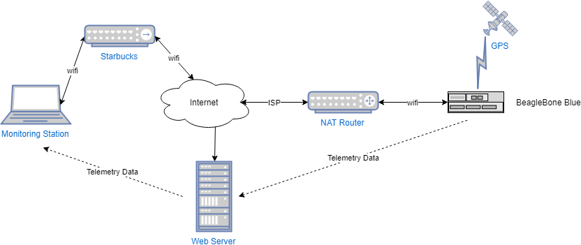
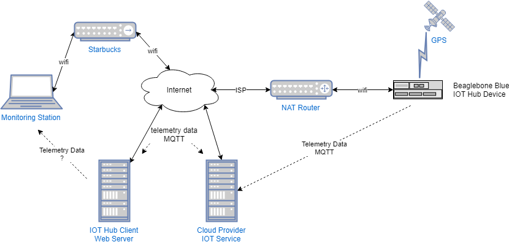

Internet-of-Things Simple Telemetry on Microsoft Azure
------------------------------------------------------

Using an IoT device with some sensors on it, I want to be able to monitor them in real time
from anywhere I have cellular or wifi access, and send commands to the device. The purpose of this experiment is to see what pieces, software and hardware, 
that need to be in the solution to get it to work. 

I have several devices that I can use as an IoT Device : a Beaglebone Black, a Beaglebone Blue, a couple of Raspberry PI's and
my development workstation. They all have various sensors onboard and as add-ons. The IoT Device will be somewhere it can connect 
to the internet and uplink its sensor data. I want to be able to remotely monitor this sensor data from anywhere I can put my laptop or 
phone on the internet.
 
# Assumptions
 - the IoT device is behind a NAT router so it can't be accessed directly from the internet
 - the IoT device will provide telemetry of sensor data it acquires
 - the monitoring station laptop (or phone) will be on whatever internet connection it has available (Starbucks)
 - a web server will be located somewhere on the public internet that can serve the app that monitors the device
 - the web server backend will be able to get the data from the device, somehow
 - the data will be shown in real time, with a reasonable latency (a small number of seconds at the most)
 
# Functional Requirements and Design

- the IoT device runs Linux 
- the IoT device software should be portable to a range of platforms
- the IoT device app will be implemented with nodejs for portability
- the web server back end will use nodejs
- the web front end will be a very simple static web page that displays the data in real time.
- the monitoring device is anything with a modern browser on the internet
- because the IoT device is behind a NAT router, it must initiate the connection to the backend web server
- the connection from laptop to web server will be secured
  - HTTPS or other encrypted protocol will be used
  - access to the monitoring app will be restricted to authorized users
- the connection from the IoT device to the web server backend will be secured
  - access to the web server backend will be restricted to the IoT device only (protected from unauthorized connections)

# Software Approach

There are 3 apps in the system : the IoT device telemetry app, the web server backend and the front end app.

## Homegrown
  I could just write some code to concoct a homegrown solution, not using any external services.   
  All apps in the system will be built from the ground up. Just have some HTTP connections between the components and
  send data as needed. 
   - advantage : nothing new to learn. just write some code
   - disadvantages:
     - hard to secure (if only because security is hard to get right)
     - hard to scale

## IoT Cloud Service
   
  All three of the major could providers, Amazone AWS, Google Cloud and Microsoft Azure have 
  support for IoT devices. Their facilities are fairly similar but there is a bit of difference
  in how much there is to learn and how complex the implementation is.
  - advantages :
    - scalable to millions of devices
    - built-in security (assuming they know more about it than I do)
  - disadvangages:
    - a bit more complex (edit: turns out to be pretty easy for this simple use case)
    - a lot to learn

## New Design

I decided to attempt to use a Cloud IoT service due to better security  and scalability. Also because
I wanted to learn about them.  For this new design, an extra piece, the Cloud IoT service is added to the mix. 
In the original design, the IoT device and web server talk to each other directly. 
In the new design, each end talks via the Cloud IoT service, which adds a boatload of functionality that would a lot of work to duplication.

With either Azure IoT, Google or AWS,  my design is the same. The underlying implementation is different. Ideally, I could
structure my application to work with either service, perhaps with a library I write that supports both systems. I'll keep that 
for next time.

Here is a modified design diagram including the Cloud IoT support:

 

# Building the Solution

I prefer to develop incrementally, especially when I'm learning a new technology. I experiment with
the new stuff until I feel I know how it works then I put the pieces together one-by-one to get the full solution.
This is a bottom up approach. Then once I understand what the individual components can and should do, I can
continue with a top down implementation to tie it all together.
In this case I do the hard part first, which is learning Azure IoT and getting the device communicating. I could 
have mocked up the web front end and the Node backend first and then worked to get the back end talking to the 
IoT device via Azure. If you had a team of more than one this would have been a good way to split things up.

# Azure

I decided to start with Azure, because it turned out to have a pretty simple quickstart that did what I needed. 

Some of the following pages show code examples. You don't need to copy these. They are for information only.
I will provide a link to a github repo will all the relevant working code. There may be minor changes in that
repo vs the examples shown here.

## Step 1 - Azure IoT device sending and Workstation Receiving Telemetry

This involves basic setup of the Azure IoT device side support, and then getting the device to uplink telemetry to the Azure service. 
At this point I will use fake data to keep it simple. BTW, you don't really need a physical IoT device, you can work through most of
this using your workstation as your device. By design the cloud IoT providers don't tie the device software directly to a specific physical
piece of hardware. This allows replacement or upgrade of devices without required changes on the cloud side.

Go to [Step 1](Azure/step1/README.md). During the setup you will be following a tutorial on the Azure website, but the step 1 readme has some extra information and 
hints that can help out when doing the tutorial.

## Step 2 - Modularize the Client Side Receiver

Go to [Step 2](Azure/step2/README.md).  Turn the client side Azure IoT code into a node module.

## Step 3 - Create a Websocket Server Backend and HTML Frontend

Go to [Step 3](Azure/step3/README.md).  Create the actual client side websocket server

## Step 4 -  Deploy Solution to the Web

Go to [Step 4](Azure/step4/README.md).  Deploy the solution.
