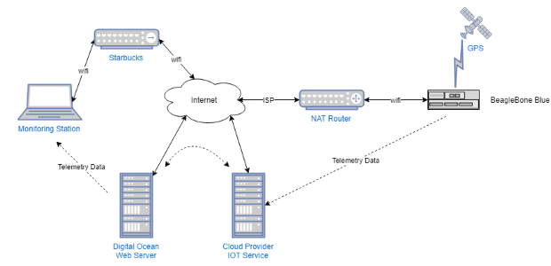

Monitoring Telemetry In The Cloud
----------------------------------

I want to do an experiment. Using an IOT device with some sensors on it, I want to be able to monitor them
from anywhere I have cellular or wifi access. The purpose of this experiment is to see what pieces, software and hardware, 
that need to be in the solution to get it to work. (Not necessarily that the result will be particularly useful)

For this attempt, I have a BeagbleBone Blue that will serve as the IOT device.
This board has various sensors on it including an IMU with accelerometers,
gyros and temperature. In addition I have a USB GPS installed on it. Great. It will be somewhere it can
connect to wifi (no cellular modem on this one) to potentially uplink its status. Ideally it would be battery powered
and have a cellular modem so I could throw it on a vehicle or a person and monitor what they are doing,  but for this
round I just want to get see the telemetry data remotely. I guess I could strap it to my dog and detect if is 
sleeping or running around the house. 

# Assumptions
 - the IOT device is behind a NAT router so it can't be accessed directly from the internet
 - the IOT device will provide telemetry of its GPS position, accelerations and orientation 
 - the monitoring station laptop will be on whatever wifi it has available
 - a web server will be located somewhere on the public internet that can serve the app that monitors the device
 - the web server backend will be able to get the data from the device, somehow
 - the data will be show in real time, with a reasonable latency (a small number of seconds at the most)
 

# Functional Design

- the IOT device runs Linux
- the IOT device app will be implemented with nodejs plus any C++ extensions needed
- the web server back end will use nodejs
- the web front end will be a React app
- the monitoring device is anything with a modern browser
- because the IOT device is behind a NAT router, it must initiate the connection to the backend web server
- the connection from laptop to web server will be secured
  - HTTPS or other encrypted protocol will be used
  - access to the monitoring app will be restricted to authorized users
- the connection from the IOT device to the web server backend will be secured
  - access to the web server backend will be restricted to the IOT device only (protected from unauthorized connections)

# Software Approach

There are 3 apps in the system : the IOT device telemetry app, the web server backend and the front end React app.

## Homegrown
   
  All apps in the system will be built from the ground up. Just have some HTTP connections between the components and
  send data as needed. 
   - advantage : simple-ish to implement. nothing new to learn
   - disadvantages:
     - hard to secure (if only because security is hard to get right)
     - hard to scale

## IOT Cloud Service
   
  All three of the major could providers, Amazone AWS, Google Cloud and Microsoft Azure have 
  support for IOT devices. Their facilities are fairly similar but there is a bit of difference
  in how much there is to learn and how complex the implementation is.
  - advantages :
    - scalable to millions of devices
    - built-in security (assuming they know more about it than I do)
  - disadvangages:
    - a bit more complex
    - a lot to learn

## New Design

I decided to attempt to use a Cloud IOT service, partly due to better security and also becuase
I wanted to learn about them 
I played around a bit with IOT services for AWS and Azure, and I found that for my purposes
Azure was easier to get something working. This is not a comparison of the products and I'm
not saying which one is better. I just found that I flailed a bit more with AWS and
especially their tutorials. I'm probably just not that smart and got lucky with Azure. Plus
I have an MSDN subscription that gives me credits for using Azure and I would have to pay
(a very small amount, a few cents) to do this on AWS.

Here is a modified design diagram including the Cloud IOT support:

 

# Building the Solution

I prefer to develop incrementally, especially when I'm learning a new technology. I experiment with
the new stuff until I feel I know how it works then I put the pieces together one-by-one to get the full solution.
In this case I do the hard part first, which is learning Azure IOT and getting the device communicating. I could 
have mocked up the React front end and the Node backend first and then worked to get the back end talking to the 
IOT device via Azure. If you had a team of more than one this would have been a good way to split things up.

## Step 1 - IOT device talking to Azure IOT service

This involves basic setup of the Azure IOT device side support, and then getting the Beaglebone to uplink telemetry to the Azure service. 
At this point I will use fake data to keep it simple. BTW, you don't really need a physical IOT device, you can work through most of
this using your workstation as your device.

Go to [Step 1](step1/README.md). During the setup you will be following a tutorial on the Azure website, but the step 1 readme has some extra information and 
hints that can help out when doing the tutorial.

## Step 2 - Client device reading data from Azure IOT service

Now that the devices is sending its data to Azure, I need to see how a client device will connect to Azure
to retrieve the data and display it. I will use a simple command line program to retrieve the data.

## Step 3 - 